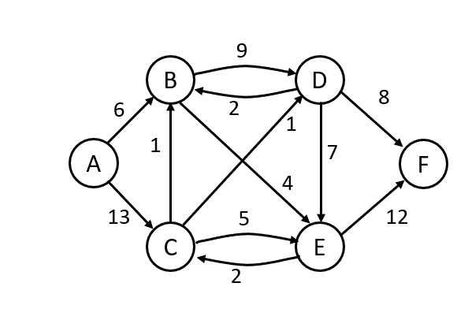

# GraphSearch
This Jupyter Notebook was created to answer a test question about finding the least-cost
path of a weighted graph. It was determined that Djikstra's algorithm was the proper
algorithm to use.

@author Ross Adams
Fall 2020
